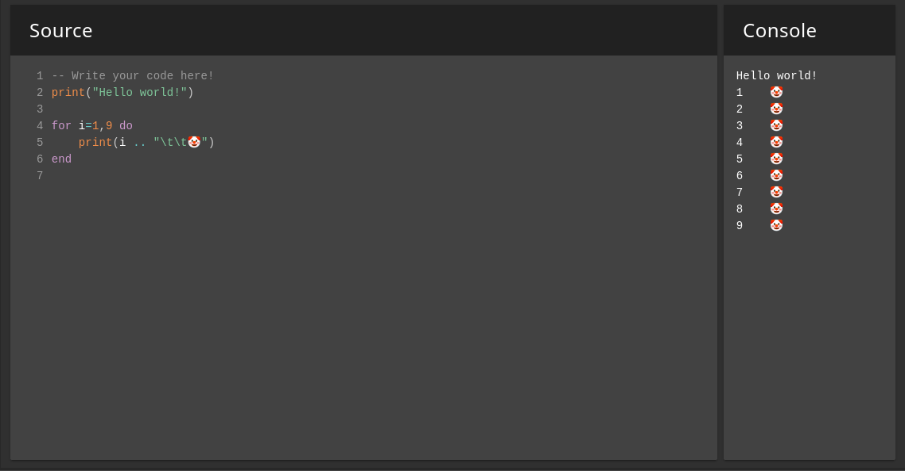

# VitaIDE
A web-based Lua IDE for the Vita, with an included FTP server.


Components:
- Vue web-app (stored on Vita)
- Custom HTTP server + Lua engine backend to serve app (runs on Vita)
- [FTP server](https://github.com/xerpi/libftpvita) to assist patching and development (also runs on Vita)

## Building
First, the website can optionally be built (see dependencies):
```
cd site
npm install
npm run build
```

Then build the VPK file in the root folder:
```
mkdir build
cd build
cmake ..
make -j 16
```

## Installing
Move the VPK file from the build directory to the Vita and install as usual.

## Depdencies
You will need a working installation of the [VitaSDK](https://vitasdk.org/). VitaIDE also uses [Lua](https://www.lua.org/) (included in the project), and makes use of [libftpvita](https://github.com/xerpi/libftpvita) (included too, as part of the VitaSDK).

The website comes pre-built, but for development you will need [npm](https://www.npmjs.com/). From there see the build instructions to install [Vue.js](https://vuejs.org/), [Vue Material](https://www.creative-tim.com/vuematerial/) and other depepdencies.
